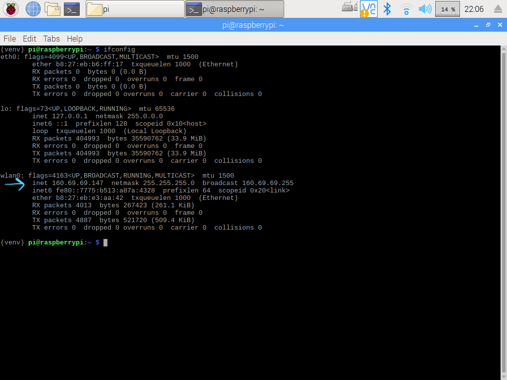
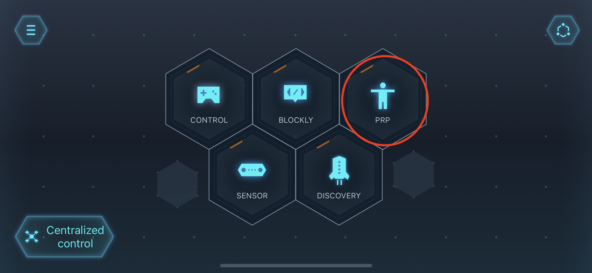
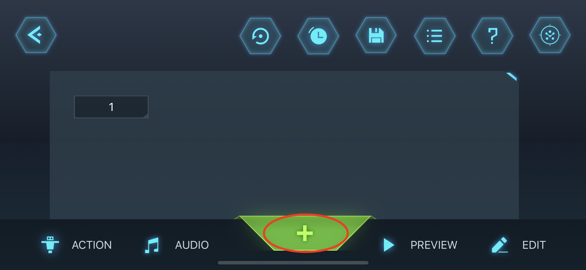
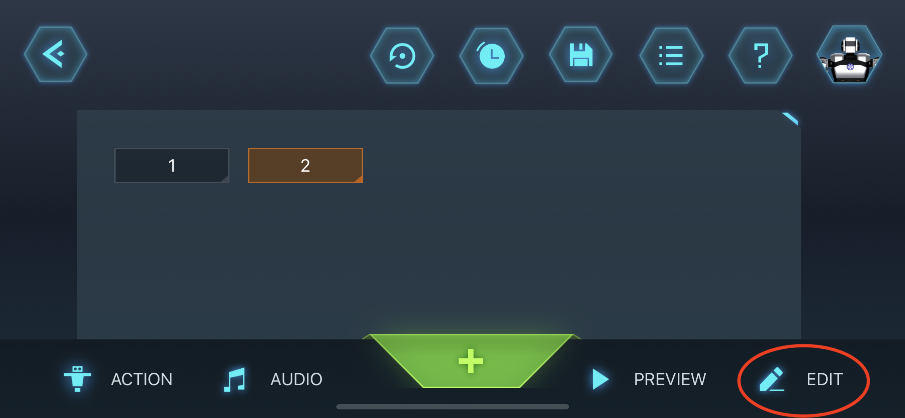

# End-User Interface Final Year Project
These are the Python scripts that are used to code the Yanshee Robot for the final year project.

## Setting up the Yanshee Robot
1. Find the IP Address
    - This can be done by checking the Yanshee App. <span style="color: red"> Note that the robot and the phone must be connected to the same WiFi router. Do not use a WiFi router that dynamically changes its IP address such as eduroam.</span> In the Yanshee App, touch on the top-left icon.
    
    - Click on Setup.
    
    - Then Robot Information.
    
    - The IP Address will be displayed at the bottom of the list.
    
    - This can also be done by connecting the robot to a screen through HDMI and then typing "ifconfig" on the Terminal. The IP Address would appear under wlan0.
    
2. Insert it into your code.
    - Make sure to import the YanAPI and a string variable to store the IP Address. Use the function YanAPI.yan_api_init() to connect to the robot.

### YanAPI checklist
All Yanshee Robots connected remotely must have YanAPI.yan_api_init() function set up.

### Emergency Button
In case of an emergency, push the button on the head of the robot. <br />


## Setting up the Environment and Basecode
### Minimum Requirements
1. Access to a Linux-like terminal
2. Conda (installation instructions here https://docs.conda.io/projects/conda/en/latest/user-guide/install/index.html).
3. Git

### Python Environment
It is recommended to create a virtual environment for development. This will help with dependency management. It will help to make the project self-contained and easier to share and recreate. Below are instructions on creating a virtual environment and installing all required dependencies using conda. Another alternative is to use venvs + pip tools.

1. Create a new folder (The name New_Code is used as an example). Direct to it with the command
    ```console
    $ cd ~/New_Code
    ```
    and eventually clone the following repository with this command.
    ```console
    $ git clone https://github.com/pcarrenom/FYPSAR
    ```
    Then, navigate into the config folder
    ```console
    $ cd FYPSAR/config
    ```
2. Create a new conda environment for the project
    ```console
    $ conda create --name <name of your environment> --file requirements.txt
    ```
3. Install the following dependencies using pip
    ```console
    $ conda activate <name of your environment>
    $ pip install nep transitions rize
    ```

### Base Code and RIZE Interface
1. Navigate to the FYPSAR folder
    ```console
    $ cd ~/New_Code/FYPSAR
    ```
2. Follow these instructions to install nvm https://github.com/nvm-sh/nvm#install--update-script
3. Close the terminal used to install nvm and open a new one
4. Install the latest stable version of Node.js
    ```console
    $ nvm install --lts
    ```
5. Activate the latest version of Node.js in your terminal
    ```console
    $ nvm use --lts
    ```
6. Go to the Open-RIZE-beta folder and install all required dependencies
    ```console
    $ npm install
    ```
7. Add the following folder hierarchy to your Documents. All projects will be stored in ~Documents/Rize/projects

8. Using four windows in a terminal, activate your environment that you created earlier, then direct each terminal to your folder directory by typing the following to each window.
    ```console
    $ conda activate <name of your environment>
    $ cd ~/New_Code/FYPSAR
    ```
    In sequence, execute the following in each separate window:
    
    1. 
    ```console
    $ cd SCR
    $ python local_master.py
    ```
    2. 
    ```console
    $ cd RIZE
    $ npm start
    ```
    3. 
    ```console
    $ cd SCR
    $ python robot_actions.py
    ```
    4. 
    ```console
    $ cd SCR
    $ python robot_perception.py
    ```
### Creating a new motion
In order to create a new motion, make sure to have the Yanshee App installed and the robot connected to your phone
1. Select PRP from the main page

2. Select the "+" sign

3. Select the body part that you wish to create an action with before selecting on "Manual Record"

4. If you wish to fine tune the action, select the action number and then touch on "Edit" where there are options that includes fine tuning and delay time.

5. Repeat Steps 2-4 again until you have finalised your motion.