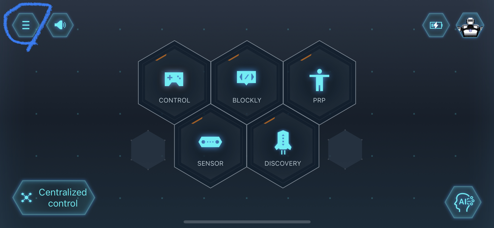
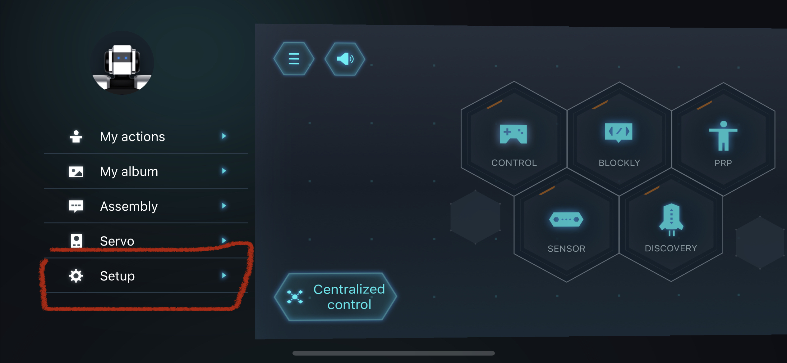
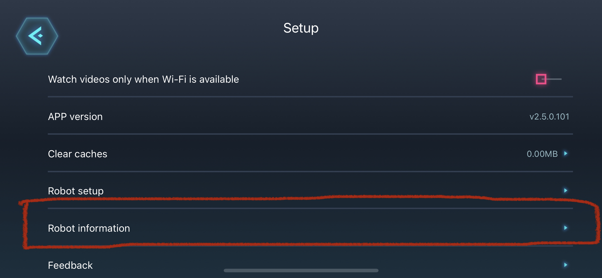
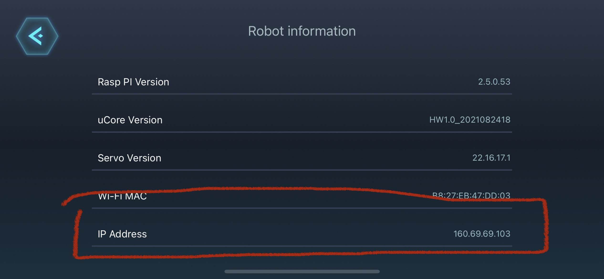
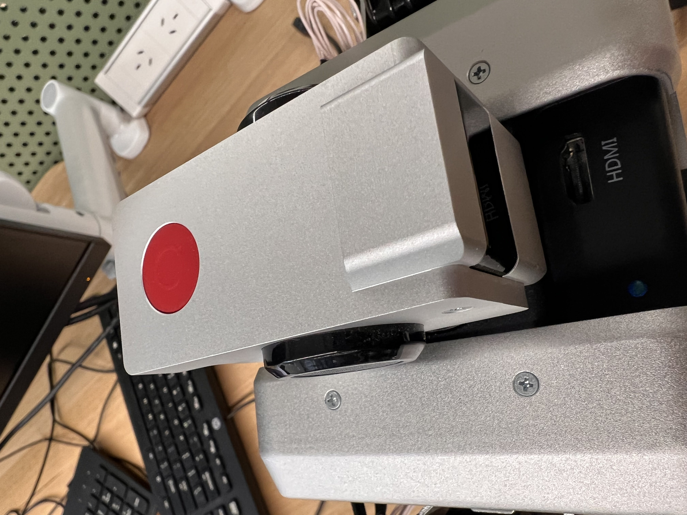

# End-User Interface Final Year Project
These are the Python scripts that are used to code the Yanshee Robot for the final year project.

## Setting up the Yanshee Robot
1. Find the IP Address
    - This can be done by checking the Yanshee App. <span style="color: red"> Note that the robot and the phone must be connected to the same WiFi router. Do not use a WiFi router that dynamically changes its IP address such as eduroam.</span> In the Yanshee App, touch on the top-left icon.
    
    - Click on Setup.
    
    - Then Robot Information.
    
    - The IP Address will be displayed at the bottom of the list.
    
2. Insert it into your code.
    - Make sure to import the YanAPI and a string variable to store the IP Address. Use the function YanAPI.yan_api_init() to connect to the robot.

### YanAPI checklist
All Yanshee Robots connected remotely must have YanAPI.yan_api_init() function set up.

### Emergency Button
In case of an emergency, push the button on the head of the robot.
{400}

## Setting up the Environment and Basecode
### Minimum Requirements
1. Access to a Linux-like terminal
2. Conda (installation instructions here https://docs.conda.io/projects/conda/en/latest/user-guide/install/index.html).
3. Git

### Python Environment
It is recommended to create a virtual environment for development. This will help with dependency management. It will help to make the project self-contained and easier to share and recreate. Below are instructions on creating a virtual environment and installing all required dependencies using conda. Another alternative is to use venvs + pip tools.

1. Create a new conda environment for the project
    ```console
    $ conda create -n <name of your environment>
    ```
2. Install the following dependencies using pip
    ```console
    $ conda activate <name of your environment>
    $ pip install nep transitions rize
    ```
3. Additional dependencies to work with the Yanshee robot might be needed

### Node and RIZE Interface
1. Follow these instructions to install nvm https://github.com/nvm-sh/nvm#install--update-script
2. Close the terminal used to install nvm and open a new one
3. Install the latest stable version of Node.js
    ```console
    $ nvm install --lts
    ```
4. Create a new folder of any name (the name New_Code will be used as an example). Inside that folder, clone the following repo
    ```console
    $ git clone https://github.com/enriquecoronadozu/Open-RIZE-beta.git
    ```
5. Activate the latest version of Node.js in your terminal
    ```console
    $ nvm use --lts
    ```
6. Go to the Open-RIZE-beta folder and install all required dependencies
    ```console
    $ npm install
    ```
7. Add the following folder hierarchy to your Documents. All projects will be stored in ~Documents/Rize/projects

8. Run RIZE using the following command
    ```console
    $ npm start
    ```

### Base Code
1. Create a new folder (The name New_Code is used as an example). Direct to it with the command
    ```console
    $ cd ~/New_Code
    ```
    and eventually clone the following repository with this command.
    ```console
    $ git clone https://github.com/jjah0001/FYPSAR
    ```
2. Using four windows in a terminal, activate your environment that you created earlier, then direct each terminal to your folder directory by typing the following to each window.
    ```console
    $ conda activate <name of your environment>
    $ cd ~/New_Code
    ```
    In sequence, execute the following in each separate window:
    
    1. 
    ```console
    $ cd FYPSAR
    $ python local_master.py
    ```
    2. 
    ```console
    $ cd Open-RIZE-beta
    $ npm start
    ```
    3. 
    ```console
    $ cd FYPSAR
    $ python robot_actions.py
    ```
    4. 
    ```console
    $ cd FYPSAR
    $ python robot_perception.py
    ```
