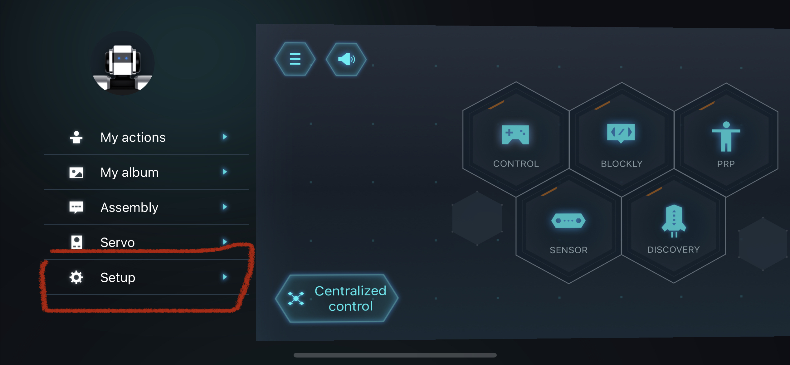

# End-User Interface Final Year Project
These are the Python scripts that are used to code the Yanshee Robot for the final year project.
## YanAPI checklist
All Yanshee Robots connected remotely must have YanAPI.yan_api_init() function set up.

## Setting up the Yanshee Robot
1. Find the IP Address
    - This can be done by checking the Yanshee App.  Note that the robot and the phone must be connected to the same WiFi router. Do not use a WiFi router that dynamically changes its IP address such as eduroam. In the Yanshee App, touch on the top-left icon.
    
    - Click on Setup.
    
    - Then Robot Information.
    
    - The IP Address will be displayed at the bottom of the list.
    
2. Insert it into your code.
    - Make sure to import the YanAPI and a string variable to store the IP Address. Use the function YanAPI.yan_api_init() to connect to the robot.

## Emergency Button
In case of an emergency, push the button on the head of the robot.

