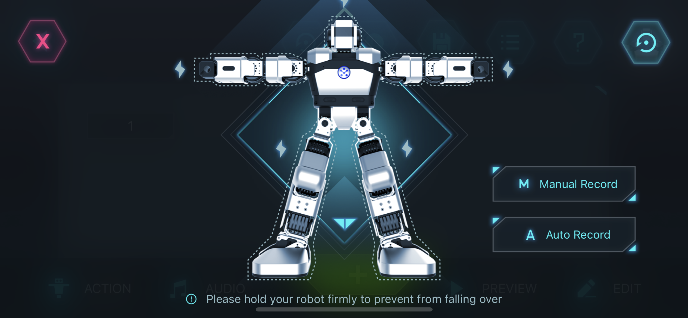

# End-User Interface Final Year Project
These are the Python scripts that are used to code the Yanshee Robot for the final year project.

## Setting up the Yanshee Robot
1. Find the IP Address
    - This can be done by checking the Yanshee App. <span style="color: red"> Note that the robot and the phone must be connected to the same WiFi router. Do not use a WiFi router that dynamically changes its IP address such as eduroam.</span> In the Yanshee App, touch on the top-left icon.
    
    - Click on Setup.
    
    - Then Robot Information.
    
    - The IP Address will be displayed at the bottom of the list.
    
    - This can also be done by connecting the robot to a screen through HDMI and then typing "ifconfig" on the Terminal. The IP Address would appear under wlan0.
    
2. Insert it into your code.
    - Make sure to import the YanAPI and a string variable to store the IP Address. Use the function YanAPI.yan_api_init() to connect to the robot.

### YanAPI checklist
All Yanshee Robots connected remotely must have YanAPI.yan_api_init() function set up.

### Emergency Button
In case of an emergency, push the button on the head of the robot. <br />


## Setting up the Environment
### Minimum Requirements
1. Access to a Linux-like environment
    - For Windows, this will require you to install Windows Subsystem for Linux (WSL). Follow installation instructions here -> https://learn.microsoft.com/en-us/windows/wsl/install
2. Conda 
    - Follow installation instructions here -> https://docs.conda.io/projects/conda/en/latest/user-guide/install/index.html
3. Git

### Python Environment
It is recommended to create a virtual environment for development. This will help with dependency management. It will help to make the project self-contained and easier to share and recreate. Below are instructions on creating a virtual environment and installing all required dependencies using conda. Another alternative is to use venvs + pip tools.

1.  Create a new folder under your user directory and direct to it via the following command
    ```console
    $ cd ~/<new_folder_name>
    ```
    Clone the repository into the new folder.
    ```console
    $ git clone https://github.com/pcarrenom/FYPSAR
    ```
2. Now we need to clone the Perception repository as a git submodule. In the FYPSAR folder, type the following command
    ```console
    $ git submodule add https://github.com/MonashRobotics/Posture-Detection
    ```


3. We will now create two new conda environments for the project. The main difference between the two environments is the python version. The robot works best with an older python version 3.5, while ideally, we have the latest available python version for posture detection. For simplicity, the environment names are named by default as railrobot and railperception.

    ```console
    $ conda create --name railrobot python==3.5
    ```
    - The dependencie4s in the requirements file needs to be resolved by pip (you may need to upgrade pip if prompted).
    - Activate the conda environment
    ```console
    $ conda activate railrobot
    ```
    - Navigate into the config folder under FYPSAR
    ```console
    $ cd FYPSAR/config
    ```
    - Install all the dependencies via pip
    ```console
    $ pip install -r robot_req.txt
    ```
    - Deactivate the environmnet or close the terminal and open a new one.
    ```console
    $ conda deactivate
    ```
    - Next, create the environment for the robot’s perception program. There is no need to specify the python version as we want the latest version. 
    ```console
    $ conda create --name railperception
    ```
    - Resolve the dependencies via pip.
    ```console
    $ pip install -r perception_req.txt
    ```

### RIZE Interface
This program requires the use of Node.js and node version manager (nvm).
1.	Open a new terminal and follow the installation instructions here -> https://github.com/nvm-sh/nvm#install--update-script

2.	Close the terminal used to install nvm and open a new one.

3. Navigate to the FYPSAR folder
    ```console
    $ cd ~/<new_folder_name>/FYPSAR
    ```
4. Install the latest stable version of Node.js
    ```console
    $ nvm install --lts
    ```
5. Activate the latest version of Node.js in your terminal
    ```console
    $ nvm use --lts
    ```
6. Go to the RIZE folder and install all required dependencies
    ```console
    $ cd ~/<new_folder_name>/FYPSAR/RIZE
    $ npm install
    ```
7. Add the following folder hierarchy to your Documents. All projects will be stored in ~Documents/Rize/projects

    


## Running the Program
You will need four terminals to run the program fully. Feel free to set up these terminals in whichever way you are most comfortable with, these terminals will be referred to as T1, T2, T3, and T4 in the following instructions.

1. In T1, T2, and T3, activate the railrobot environment.
    ```console
    $ conda activate railrobot
    ```
    - In T4, activate the railperception environment.
    ```console
    $ conda activate railperception
    ```
2. In T1, T3, and T4, navigate to the SCR folder as such
    ```console
    $ cd ~/<new_folder_name>/FYPSAR/SCR
    ```
    In T2, navigate to the RIZE folder
    ```console
    $ cd ~/<new_folder_name>/FYPSAR/RIZE
    ```

3.	Prior to running the program, you must ensure your laptop/PC and the robot are connected to the same network with a stable IP address. To connect the robot to the internet, see Connecting the Robot.

4.	In sequence, execute the following commands.

    In T1     
    ```console
    $ python local_master.py
    ```
    In T2
    ```console
    $ npm start
    ```
    In T3
    ```console
    $ python robot_actions.py
    ```
    In T4
    ```console
    $ python robot_perception.py -e
    ```

After executing all the steps above, you should be ready to use the program at its full capacity with the RIZE interface and the Yanshee robot’s detection.


## Camera Set-up
As the project is currently still in development, for the purpose of demonstration, **please situate the camera to your right at an angle of approximately 45 degrees**. This will ensure all detection functionalities run as intended. The camera should be able to capture your body from the hip up while you are seated.

## How to Use Robot Perception
Upon running the program, you will be asked if you would like to create a new user ID or use an existing user ID. Please see the following sections for the corresponding sequences of actions.

### For New Users
1.	Enter a user ID of your choice (a username if you will)

2.	You will now be prompted to enter some threshold values and parameters.
    - Detection Time
    - Neck Decline Threshold
    - Head Extension Threshold
    - Forward Lean Threshold
    - Twisting Threshold
    - Calibration Time
    - Still Detection Time
    - Moving Detection Time

    a. For example, a neck decline threshold of 0.8 means if your neck is in a declined position that is 80% of the calibrated value, the program will detect it as a “bad posture”.

    b. If you are unsure about these values, leave it empty and press enter for default values.

3.	Once all the parameters have been provided, the program will start and a new window showing the camera detection will appear and will enter a mandatory calibration mode. For a new user, the program will enter a mandatory calibration process. You will have *Calibration Time* seconds to adjust your position such that you are at a 45-degree angle relative to the camera, with your whole body from the hips upwards within the frame as shown in the following example.

4.	See [Calibration](#calibration) -for details of the calibration process.

### For Existing Users
1. 1.	Enter an existing user ID, feel free to check in the file hierarchy under the folder **./FYPSAR/SCR** to check the existing username.

### Using the Program
Once you have the program running, you will be greeted with an additional window capturing the input from the OAK-D camera. For each session, you would need to run the calibration (see [Calibration](#calibration)).

Once you have ran the calibration, you will be able to use the keyboard shortcuts below to begin a desired detection.

| Keypress in Program window    | Function                                                                                              |
|-------------------------------|-------------------------------------------------------------------------------------------------------|
| Esc/q	                        | Exit                                                                                                  |
| space	                        | Pause                                                                                                 |
| r	                            | Show/hide the bound rotated rectangle around the body                                                 |
| l	                            | Show/hide landmarks                                                                                   |
| f	                            | Show/hide FPS                                                                                         |
| k	                            | Begin calibrating user settings                                                                       |
| n	                            | Enable/Disable Downwards Neck Angle Detection                                                         |
| m	                            | Enable/Disable Forward Leaning Angle Detection                                                        |
| n/j + m	                    | Enable/Disable Slouching Detection (Both Forward Leaning and Either Head detections must be enabled)  |
| b	                            | Enable/Disable Twisting Shoulder Detection                                                            |
| j	                            | Enable/Disable Forward Head Detection                                                                 |
| h	                            | Start Recording Landmark Data into a CSV                                                              |


## Calibration
A new calibration is needed, or at least highly recommended, for each unique session with the perception program. Once the calibration key “K” has been pressed, the process will be as follows. Each step of the process will last as long as the initial parameter that you have provided under your username. For example, if you entered 4 for ‘Calibration Time’, each step would last 4 seconds. 

1.	You will have 4 seconds to move around freely and get into position. This assumes you have followed the Camera Set-up instructions. 

2.	You will then have to sit as still as possible in a “good” posture for 4 seconds. Try to be comfortable but maintain an upright posture.

3.	The calibration will then ask you to do the following in sequence. At the moment these steps are consecutive and without audio cues. These are essentially the “bad” postures that will be detected. For the calibration process, take these steps to a comfortable extreme without exaggerating the pose.
    
    - Look down 
    
    - Extend your head forward (without leaning forward)
    
    - Lean forward (ideally keeping your back straight)
    
    - Twist your upper body to the right
    
    - Twist your upper body to the left.

4.	Once the above steps have been completed, the calibration for your current session is done. If you change your natural position, or if you move the camera, you may need to calibrate again. If that’s the case, just press “K” and follow the steps above.


## Creating a new motion
In order to create a new motion, make sure to have the Yanshee App installed and the robot connected to your phone
1. Select PRP from the main page

2. Select the "+" sign

3. Select the body part that you wish to create an action with before selecting on "Manual Record"

4. If you wish to fine tune the action, select the action number and then touch on "Edit" where there are options that includes fine tuning and delay time.

5. Repeat Steps 2-4 again until you have finalised your motion.